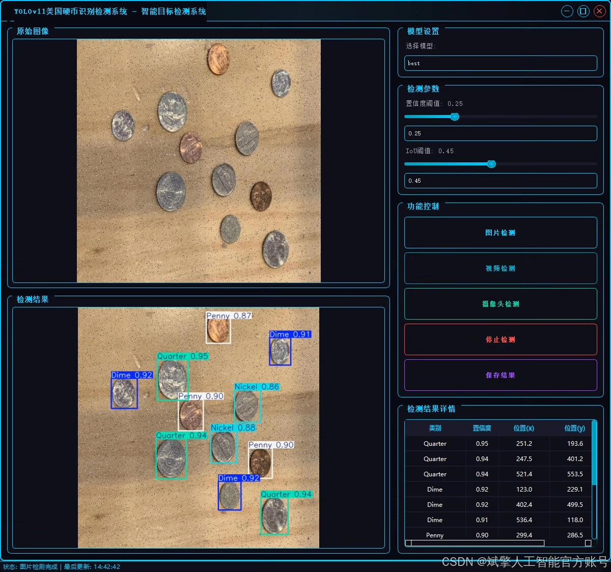
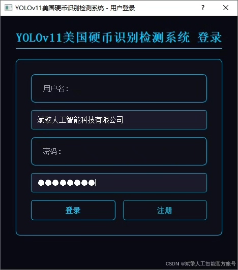
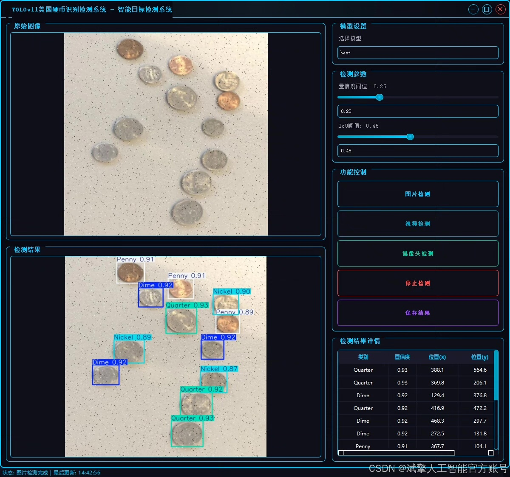
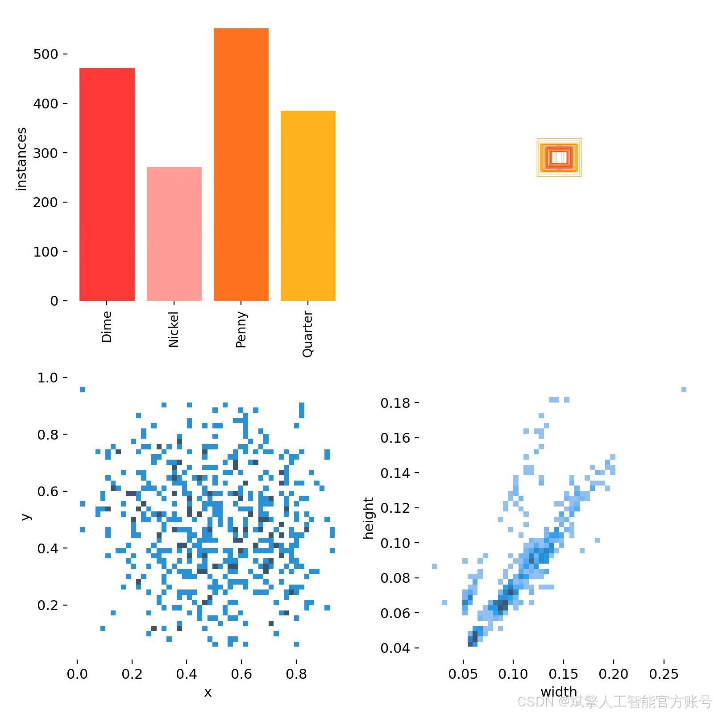
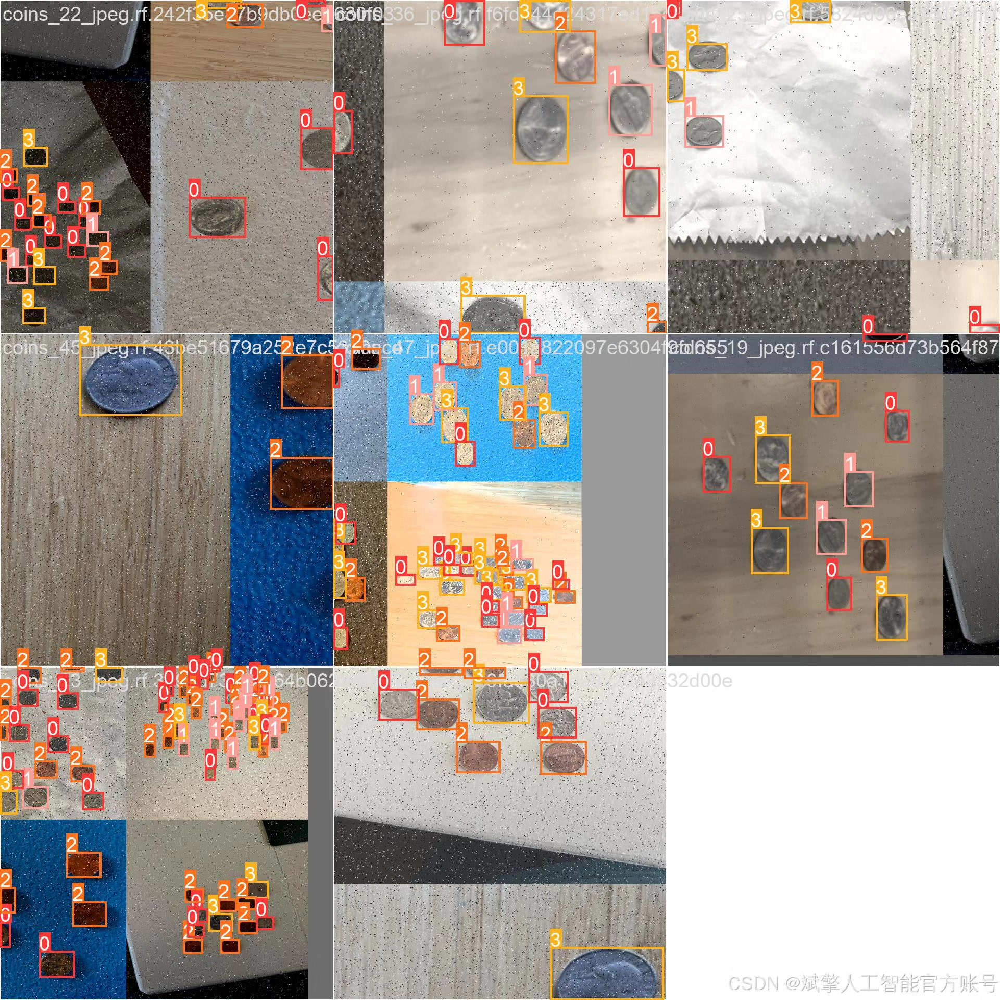
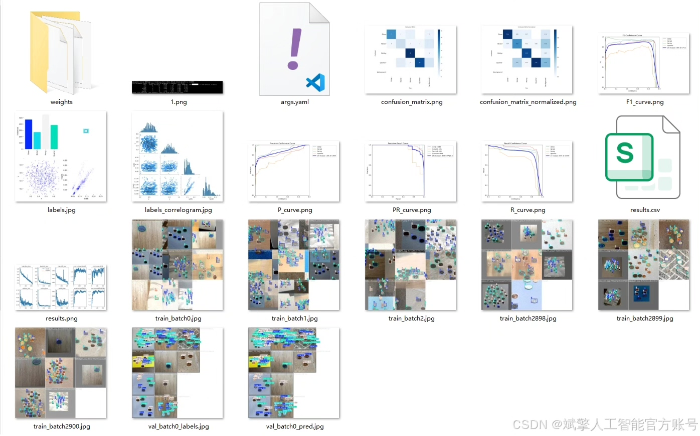
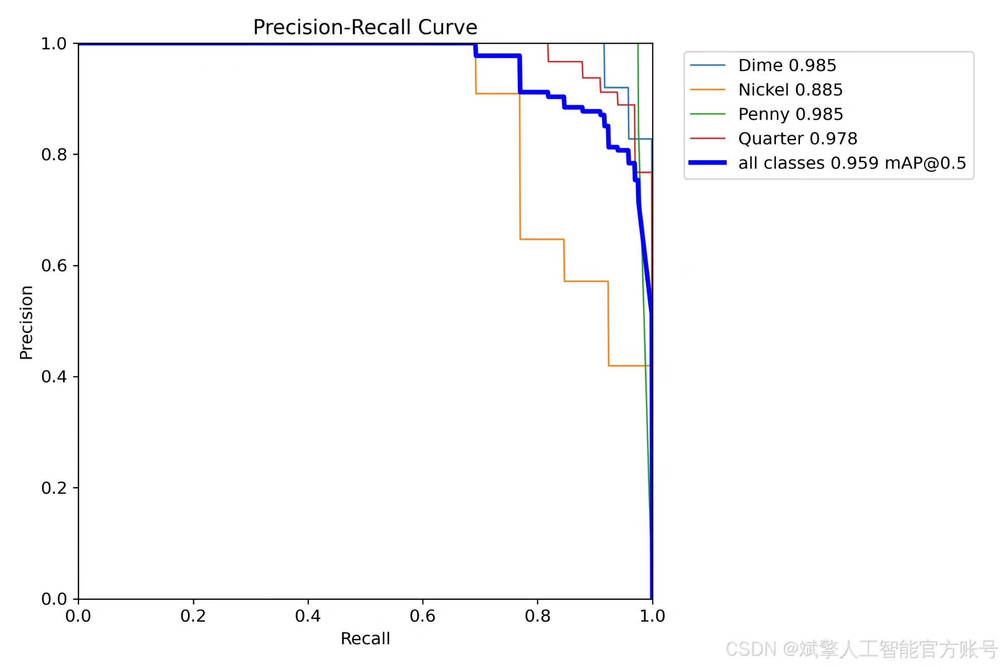
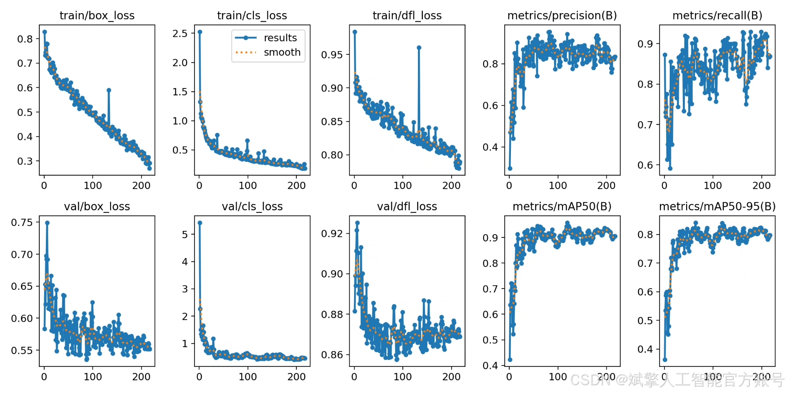
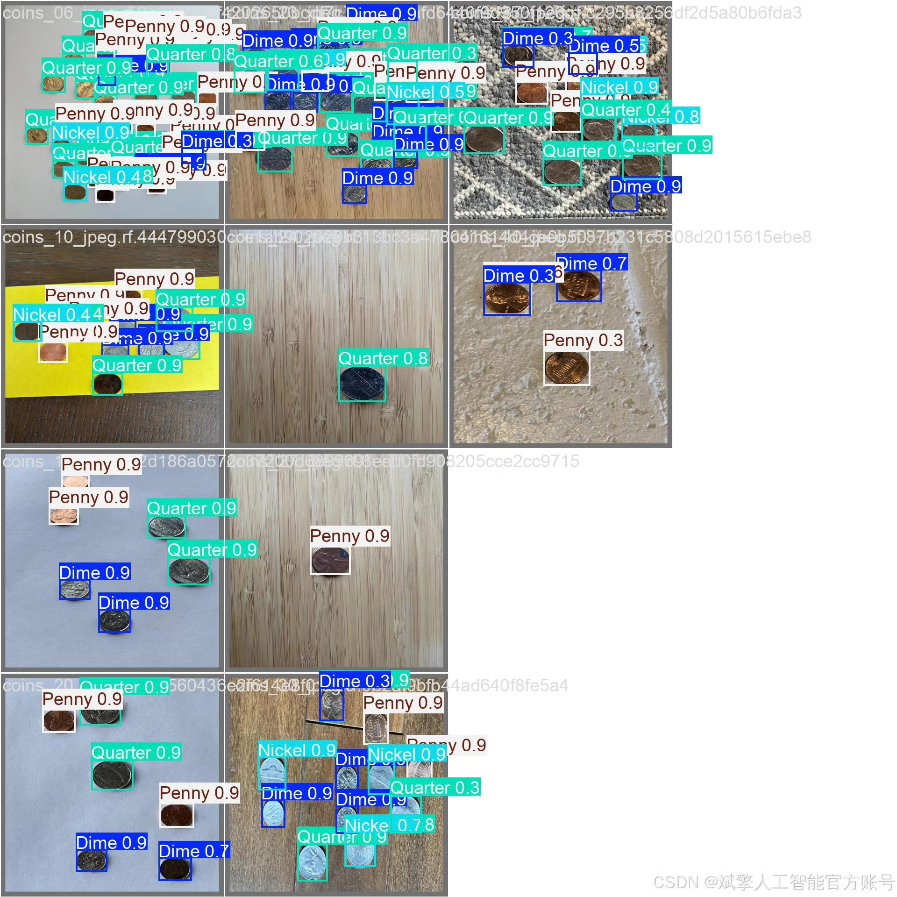

# YOLOv11 Coin Recognition System

## Body

YOLOv11 Coins Recognition System Based on Deep Learning YOLOv11: A U.S. Coins Recognition Detection System (YOLOv11+YOLO dataset + UI interface + login and registration interfaces + Python project source code + model)

This paper proposes a deep learning target detection model YOLOv11-based U.S. coins recognition detection system, which can efficiently and accurately recognize four common U.S. coins (Dime, Nickel, Penny, Quarter). By combining the high real-time advantages of the YOLOv11 algorithm with a custom labeled YOLO format dataset, the system achieves a high precision and recall rate in the coin detection task. Additionally, the system is designed with a user-friendly UI interface and integrated login and registration functions. The project is developed in Python, providing complete source code, pre-trained models, and datasets, offering an extensible solution for coin recognition applications (such as automatic vending machines, financial counting). Experimental results show that the system has an accuracy rate of over 95% in complex backgrounds, demonstrating strong robustness.

✅ User Login and Registration: Supports password verification and security validation.
✅ Three detection modes: Based on the YOLOv11 model, supports image, video, and real-time camera detection, with precise target recognition.
✅ Dual-screen comparison: Displays the original scene and detection results on the same screen.
✅ Data visualization: Real-time table displays the category, confidence, and coordinates of detected targets.
✅ Intelligent parameter adjustment: Offers a confidence slide bar to dynamically optimize detection accuracy, adapting to different scene requirements.
✅ Sci-fi style interactive interface: Dark theme combined with dynamic light effects, reducing visual fatigue and enhancing operational experience.

## Images

## Payment

Here is a pay link on Stripe ( https://buy.stripe.com/3cs8yP7sY87d0vu9AB ). Please contact me lonlonago@foxmail.com after funding $89, and I will send you a complete data files , thank you!

